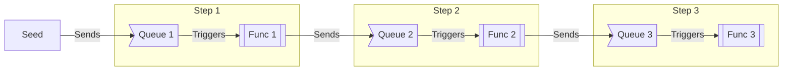

# Multi-stage processor using Azure Service Bus and Azure Functions

## Concept

We have an Azure Service Bus Queue and a Azure Function for every step of the multi-step process.

There are two benefits of this approach:
1. The built-in scaling of Azure Functions means each part of the process can dynamically scale to handle the load - fast steps of the process can be scaled lower and slower steps can be scaled higher, processing more in parallel
2. The Azure Service Bus allows us to have a built-in 'snapshot' of the process. If step 3 of a process is broken we can restart the process from there without needing to redo steps 1 and 2.

### Prerequisites
- Each step is discrete and atomic. We don't end up in a place where we completed 1/2 of a step and must manage a partial re-execution.
  - Any non-atomic step needs to be broken into its atomic components when building this
- Each non-idempotent step also includes a pure mode, so that if it is re-run when we have already completed the step, it can just get the data to pass on without performing the task again

### Process
What this does is receive a "seed" message by step 1. This is processed before being passed to step 2 and so on until the process is completed.

In this demo application we simply fake doing work by delaying by 1 second before carrying on.

**NOTE:** The step names (`step1`, `step2`, `step3`) are indicative only.
In a real situation the function, queue and property names should be based on the task the step will perform.

Although it simplifies following the order initially, ideally the name shouldn't include an ordering number, e.g. `01_do-thing.ts`.
That will complicate adding, removing, or reordering steps later.

## Message Contents

The message contains the following base properties:
    - `idempotencyId` - A unique ID used to ensure each step is executed exactly once
    - `completedStages` - A bitwise flag representing the completed steps. This is stored in the message as well as Redis so we can detect if the stages have been wired up incorrectly and we've ended up in an infinite loop. A bitwise flag allows us to determine if this step has already been completed even if it was several steps earlier.

Each step contains its own data as a top-level property. Care needs to be taken here to ensure these properties don't collide so we retain all the required data for the process.

## Internal Persistence and Idempotence

There are multiple ways each step in the process can go wrong:

**Happy Path of each function:**
1. The function is triggered from the queue successfully, and the message is not corrupted etc.
2. We haven't processed this item yet
3. We perform our task successfully
4. We push the (updated if necessary) item to the next queue successfully
5. We complete the item from the queue successfully

Therefore we need to handle 5 potential failure concepts.

### ❌ We fail to trigger from the queue

This is handled by Azure Service Bus. We will retry when the message next becomes available for processing, and will go to the DLQ if we repeatedly fail.

### ❌ We have processed this item already

We need a redis cache and an idempotency ID in the message so we can tell if we have already handled the message.

If the action this step performs is idempotent, we reprocess it completely every time independent of whether we have already processed it. Otherwise we need to be aware of if we have already handled the message and need to short-circuit and handle the message correctly to prevent double-handling while also avoiding losing the message later in the process.

- If we don't need to add anything to the model, we just pass it on to the next queue without performing our task
- If we do need to add to the model, the function also provides a pure version of its functionality to retrieve the data we would've had if we did fully process the task

### ❌ We fail to perform our task

We just ensure that we don't complete the item from the incoming queue and Azure Service Bus will handle it from there.

If we are performing a non-idempotent action we should architect the process in a way which makes it atomic - we either completely succeed or fail - we can't e.g. complete 1/2 of the task before failing.

If it is unavoidable to have multiple steps in a single function we need to ensure the status of where we got to is recorded to be looked up when we retry.

### ❌ We fail to push the item to the next queue

This is where the redis cache comes in. We need to "fail" to process the item, but know that we won't reprocess it (unless it's idempotent) and just use the function trigger as a cue to retry pushing the message to the next queue

### ❌ We fail to complete the item from the queue

This also relies on redis, and the Azure Service Bus duplicate detection feature. When we reprocess the item, redis will help us to recognise we have already completed this step, and we will just push the message onto the next queue, which if we have already pushed the message recently will automatically ignore the duplicate.

## Language/Runtime Choice

I chose to implement this demo in TypeScript rather than C# for one relatively simple reason. When serializing/deserializing data in .NET, unless you go out of your way to do so, only the data specifically defined in your model will be retained, and all other data will be lost. The way this concept is handled by JavaScript runtimes is more liberal. All data will remain in the models and will be passed through the whole process.

The types (and type guards) defined in TypeScript will allow us to work safely with the data we care about without being overloaded with fields which may or may not be there just so it can be used in other steps.

## Limitations of this Demo

The primary limitation of this demo is the lack of external functionality - Redis, external APIs, Entra ID, etc.
These would be implemented similarly to how `queue-utils` is implemeted to allow all functions to share logic related to interacting with the service bus.
